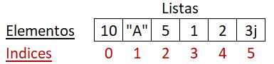

# Secuencias
Las secuencias en **Python** se pueden pensar como contenedores de datos,
entre las secuencias hay dos categorias: las que son **mutables** y las que no
(**inmutables**). Las mutables son las que pueden ser modificadas (agregar,
actualizar o eliminar elementos) despues de creadas, las immutables no cuentan
con esta propiedad. Todas las secuencias son **iterables**, esto quiere decir que
mediante un ciclo se puede acceder a los elementos que contiene. Las siguientes
funciones son validas para todas las secuencias:

```python
x = [0,1,2,3]
print(len(x)) #(len) retorna un entero con el tamaño de la secuencia
#>>> 4
print(min(x)) #(min) retorna el elemento "menor" de la secuencia
#>>> 0
print(max(x)) #(max) retorna el elemento "mayor" de la secuencia
#>>> 3
print(any(x)) #(any) retorna True si alguno de los valores son "Verdaderos", si no False
#>>> True
print(all(x)) #(all) retorna True si todos los valores son "Verdaderos", si no False
#>>> False
```


Puede referirse a el [modelo de datos](https://docs.python.org/3/reference/datamodel.html) de la documentación oficial de **Python** para más información sobre secuencias.

## Listas
Las listas son un tipo de secuencia **mutable** en **Python** que permite almacenar 
cualquier otro tipo de dato (enteros, cadenas, flotantes, listas, ...),
cada elemento dentro de la lista tiene un indice asociado, con el indice
se puede acceder al elemento, tambien se puede reemplazar o actualizar 
el elemento en esa posición, por ejemplo:

```python
x = [10, "A", 5, 1, 2, 3j]
print(x[2])
#>>> 5
```

en el ejemplo `x` es una lista con 6 elementos, el elemento de más
a la izquierda tiene indice 0 (este es el primer elemento) y el elemento de más a la derecha tiene
indice 5 (este es el último elemento). En la siguiente imagen se pueden ver los elementos
de la lista `x` con su correspondiente indice:

<div id="indices" style="display: inline;"></div>




para  acceder a un elemento en la lista utilizamos su indice, en el ejemplo anterior se accedio al
tercer elemento de la lista (el que tiene indice 2) y luego se imprimio. La sintaxis para acceder
a un elemento es `lista[indice]` donde `lista` es el nombre de la variable o el literal
de la lista que se va a utilizar e `indice` es el indice (un número entero) del elemento al cual se va a 
acceder. En caso de que el indice sea mayor o igual a la cantidad de elementos que hay en la
lista, **Python** arroja un error, por ejemplo:


```python
print(x[5]) #Error
#>>> IndexError: list index out of range
```


El `indice` también puede ser negativo, en este caso es como si la lista comenzara desde
el último elemento, entonces el indice del útlimo elemento es -1 y el del primer elemento
(de la lista `x`) es -5. En la siguiente imagen se pueden ver los elementos
de la lista `x` con su correspondiente indice negativo:


al igual que con indices positivos, al intentar acceder con un indice negativo que no está asociado a ningun elemento, **Python** arroja un error, por ejemplo:

```python
print(x[-7]) #Error
#>>> IndexError: list index out of range
print(x[-6]) #Ok
#>>> 10
```


<div id="slicing" style="display: inline;"></div>

Existe tambien la posibilidad de sacar una sublista de una lista, esto se conoce como **slicing** o **recortar**, la sintaxis es `lista[start:stop:step]`, donde `start`,`stop` y `step` son enteros, la lista resultante es `[lista[start], lista[start+step], lista[start+2*step], ..., lista[k]]`, donde `k` es un número menor que `stop` (esto quiere decir que la sublista no contiene el elemento en la posición `stop`, si este existe), por ejemplo:


```python
print(x[1:6:2]) #saca los elementos cuya posición sea impar
#>>> ['A', 1, 3j]
print(x[1:100:2]) #lo mismo que la anterior (note que stop>len(x))
#>>> ['A', 1, 3j]
print(x[50:100:5]) #en este caso el rango produce una lista vacia
#>>> []
print(x[-1:-6:-1]) #soporta rangos negativos
#>>> [3j, 2, 1, 5, 'A']
print(x[2::2]) #stop es opcional (se asume que es hasta el final de la lista)
#>>> [5, 2]
print(x[::2]) #start es opcional (se asume que es desde la posicion 0)
#>>> [10, 5, 2]
print(x[::]) #step es opcional (se asume que es 1)
#>>> [10, 'A', 5, 1, 2, 3j]
```


Una lista puede ser modificada cambiando, agregando o eliminando un elemento (entre otras operaciones que se puede hacer con una lista), la forma en la cual se pueden hacer estas modificaciones es presentada a continuación:

```python
x[0] = 100 #actualizar un elemento
print(x)
#>>> [100, 'A', 5, 1, 2, 3j]
x.append(200) #(append) recibe como parametro un elemento y lo agrega al final
#>>> [100, 'A', 5, 1, 2, 3j, 200]
y = x.pop(2) #(pop) recibe como parametro un indice, elimina y retorna el elemento indicado
print(x,y)
#>>> [100, 'A', 1, 2, 3j, 200] 5
```


## Strings (Cadenas)
Los strings son secuencias que almacenan [caracterés](https://es.wikipedia.org/wiki/Car%C3%A1cter_(tipo_de_dato)), son un tipo de secuencia **inmutable** y al igual que las listas, cada caracter dentro de un string tiene un [indice asociado](#indices) y con estos se puede acceder a cada uno de los caracteres o a un substring utilizando [**slicings**](#slicing). El siguiente ejemplo ilustra el uso básico de los strings:


```python
a = "He"
b = "llos"
c = a + b #Contanación de cadenas, c == "Hellos"
print(c[0:5]) #Generar un substring
#>>> Hello
a[1] = "i" #Error, las cadenas son inmutables
a = "Hi" #Ok, reasignación de la variable
```


En **Python** las cadenas están [codificadas](https://en.wikipedia.org/wiki/Character_encoding) utilizando [**UTF-8**](https://en.wikipedia.org/wiki/UTF-8) que es una implementación del estandar de codificación [**Unicode**](https://en.wikipedia.org/wiki/Unicode), esto permite que **Python** pueda manipular caracterés en cualquier idioma, por ejemplo:


```python
versión = "8ª"
campaña = 1 #Las variables se pueden nombrar con acentos y tildes
ħ = 1.054571e-34 #Constante de Planck reducida
```


Cada caracter (ya sea parte del nombre de una variable o parte de un string) tiene un codigo asociado, definido en **Unicode** y representado normalmente utilizando [números hexadecimales](https://en.wikipedia.org/wiki/Hexadecimal), por ejemplo la letra *a* tiene el código *U+0061*, la letra *A* tiene el código *U+0041*, la letra griega *Ω* (Omega) tiene el código *U+03A9*, ... (Note que el código comienza con *U+* que se utiliza para indicar que los siguientes digitos en hexadecimal son los que identifican al caracter). Si por compatbilidad con otros esquemas de codificación como [ASCII](https://es.wikipedia.org/wiki/ASCII), [CP-1252](https://es.wikipedia.org/wiki/Windows-1252) o [ISO 8859-1](https://en.wikipedia.org/wiki/ISO/IEC_8859-1) (este último conocido tambien como *latin1*), no puede escribir ciertos caracteres, se pueden escribir directamente los codigos asociados a los caracteres, por ejemplo:


```python
#Para colocar el codigo asociado a un caracter
#dentro de un string, se debe colocar primero
#\u seguido del codigo (4 digitos hexadecimales)
version = "8\u00AA"
#Note que no se puede colocar el codigo
#directamente en el nombre de las variables,
#necesariamente se debe reescribir la variable
campanha = 1
h = 1.054571e-34 #Constante de Planck reducida
```


Para saber el codigo asociado a un caracter en **Unicode**, se puede utilizar la función incorporada *ord*:


```python
print(ord("ª")) #El resultado es un número entero
#>>> 170
print(hex(ord("ª"))) #(hex) retorna un string con el entero en hexadecimal
#>>> 0xaa
print("ª" == "\u00aa")
#>>> True
```


Para obtener el caracter asociado a un codigo en **Unicode**, se puede utilizar la función incorporada *chr*:


```python
print(chr(170)) #(chr) recibe un entero y retorna un caracter
#>>> ª
print(chr(0xaa)) #En Python los números hexadecimales comienzan con 0x
#>>> ª
print(chr(ord("ª"))) #las funciones chr y ord son inversas
#>>> ª
```


Hay caracterés que se utilizan para representar una acción (no el simbolo de una letra de un alfabeto), como *\n* que representa un salto de linea o *\t* que representa una tabulación (generalmente produce el equivalente a 2 o 4 espacios):


```python
print("dos\npalabras")
#>>> dos
#>>> lineas
print("dos\tpalabras")
#>>> dos	lineas
print("dos\\palabras") # el backslash (\) es un caracter especial
#>>> dos\palabras
print("comillas dobles \"") #es necesario colocar \ para mostrar las comillas dobles
#>>> comillas dobles "
print('comillas dobles "') #en este caso no es necesario
#>>> comillas dobles "
print("goma\rra") #\r retorna el cursor al inicio de la linea y sobre escribe lo que haya
#>>> rama
print("gorra\rgue") #en este caso la o cambia por u y la e queda encima de una r
#>>> guera
print("gorra\rguerra") #aqui se sobreescribe todo lo que había en la linea
#>>> guerra
```


Para más información acerca del uso de **Unicode** en **Python**, consulte [Unicode HOWTO](https://docs.python.org/3/howto/unicode.html).


Las cadenas cuentan con varios metodos que se pueden categorizar por funcionalidad de la siguiente manera:

* **Metodos de verificación**: Estos metodos no reciben parametros, retornan `True` si la cadena contiene al menos un caracter y si cumple con la condición especificada por el metodo, de otra forma retornan `False`:

    * *isalnum* : verifica si la cadena solo contiene caracteres alfanúmericos.

        
        ```python
        s1 = "ABbc123.\t\n"
        print(s1.isalnum()) #>>> False
        print(s1[:7].isalnum()) #>>> True
        ```
        

    * *isalpha* : verifica si la cadena solo contiene caracteres alfabeticos.
        
        
        ```python
        s1 = "ABbc123. \t\n"
        print(s1.isalpha()) #>>> False
        print(s1[:4].isalpha()) #>>> True
        ```
        

    * *isnumeric*: verifica si la cadena solo contiene caracteres númericos.

        
        ```python
        s1 = "ABbc123. \t\n"
        print(s1.isnumeric()) #>>> False
        print(s1[4:7].isnumeric()) #>>> True
        ```
        
    
    * *isspace*: verifica si la cadena solo contiene caracteres considerados como espacios en blanco.

        
        ```python
        s1 = "ABbc123. \t\n"
        print(s1.isspace()) #>>> False
        print(s1[8:].isspace()) #>>> True
        ```
        
    
    * *isupper*: verifica si la cadena solo contiene caracteres en mayuscula.

        
        ```python
        s1 = "ABbc123. \t\n"
        print(s1.isupper()) #>>> False
        print(s1[:2].isupper()) #>>> True
        ```
        
    
    * *islower*: verifica si la cadena solo contiene caracteres en minuscula.

        
        ```python
        s1 = "ABbc123. \t\n"
        print(s1.islower()) #>>> False
        print(s1[2:].islower()) #>>> True
        ```
        

* **Metodos de transformación**: Estos metodos no reciben parametros, retornan una copia de la cadena despues de aplicarle la transformación especificada:

    * *capitalize* : Convierte el primer caracter de la cadena en mayuscula y los demás los convierte a minuscula

        
        ```python
        print("Texto mIxTo".capitalize())
        #>>> Texto mixto
        ```
        
    
    * *lower* : Convierte todos los caracteres a minuscula

        
        ```python
        print("Texto mIxTo".lower())
        #>>> texto mixto
        ```
        
    
    * *swapcase* : Convierte minusculas a mayusculas y viceversa

        
        ```python
        print("Texto mIxTo".swapcase())
        #>>> tEXTO MiXtO
        ```
        
    
    * *title* : Convierte la primera letra en mayuscula de cada palabra en la cadena

        
        ```python
        print("Texto mIxTo".title())
        #>>> Texto Mixto
        ```
        
    
    * *upper* : Convierte todos los caracteres a mayuscula

        
        ```python
        print("Texto mIxTo".upper())
        #>>> TEXTO MIXTO
        ```
        