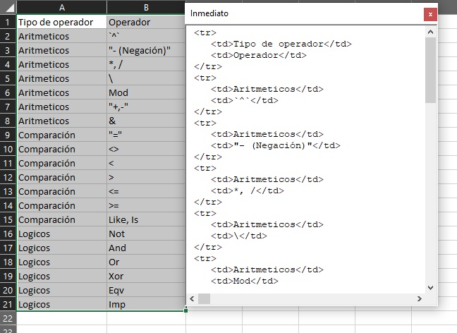

# Tabla a HTML en Excel

En este ejemplo de programación en Excel utilizando **VBA** se implementa un conversor de una tabla(conjunto de celdas continuas) a una tabla en HTML:

[Descargar](./tablaAhtml.xlsm)

Tenga en cuenta que tiene que colocar los datos de la tabla en celdas contiguas comenzando desde la **A1** (como se puede ver en la imagen), seleccione los datos, ejecute la macro **latextable** y el resultado de la conversión aparecera en la ventana de inmediato de **VBA** (Presione *Alt+F11* y luego presione *Ctrl+g* para ver la ventana de inmediato)
