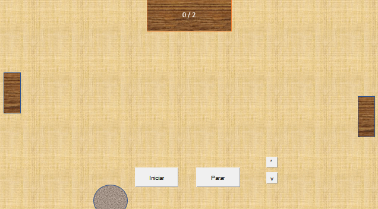

# Ping Pong en PowerPoint

Este ejemplo de programación en PowerPoint utilizando **VBA** desarrolla el clasico juego de ping pong:

[Descargar](./ping_pong.pptm)

tenga en cuenta que para poder iniciar o parar el juego debe estar en modo presentación y presionar el boton *Iniciar* o *Parar*, respectivamente, para mover los bloques laterales tambien debe estar en modo presentación y presionar cualquiera de los botones con flechas disponibles en la pantalla. Esta aplicación sirve como demostración de las funcionalidades de PowerPoint cuando se utiliza **VBA**.